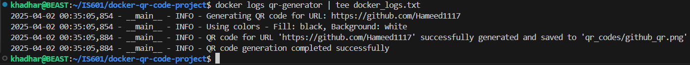

# Docker QR Code Generator Project

This project combines Docker with Python to create a containerized application that generates a QR code for a GitHub profile URL. When scanned with a mobile device, the QR code will direct users to the specified GitHub profile.

## Project Components

- Python script using the `qrcode` library to generate QR codes
- Docker containerization for easy deployment and execution
- Environment variables for customization

## QR Code to My GitHub Profile


## Docker Build and Run Log



## How to Use

### Build the Docker image:
```bash
docker build -t my-qr-app .
```

### Run the container with default settings:
```bash
docker run -d --name qr-generator my-qr-app
```

### Run with custom GitHub URL:
```bash
docker run -d --name qr-generator \
  -e QR_DATA_URL="https://github.com/Hameed1117" \
  -v "$(pwd)/qr_codes:/app/qr_codes" \
  my-qr-app
```

### Customization Options:
You can customize the QR code generation using these environment variables:
- `QR_DATA_URL`: The URL the QR code will point to (default: your GitHub)
- `QR_CODE_DIR`: Directory to store QR codes (default: 'qr_codes')
- `QR_CODE_FILENAME`: Filename for the QR code (default: 'github_qr.png')
- `FILL_COLOR`: Color of the QR code (default: 'black')
- `BACK_COLOR`: Background color (default: 'white')

### View logs:
```bash
docker logs qr-generator
```

## Implementation Details

The project uses:
- Python 3.9 with the qrcode[pil] library
- Docker to containerize the application
- Volume mounting to access generated QR codes

## FullFilling Requirements

This project fulfills the requirements of creating a Docker container that:
1. Generates a QR code linking to a GitHub profile
2. Uses environment variables for customization
3. Uses volume mounting to access the generated QR code
4. Provides proper logging of the process


---

## CI/CD Pipeline

For the CI/CD Pipeline implementation, please check the `ci-cd-assignment` branch of this repository. That branch contains:

- GitHub Actions workflow for automating Docker builds
- Docker Hub integration
- Separate README detailing the CI/CD implementation

You can switch to that branch with:
```bash
git checkout ci-cd-assignment
```