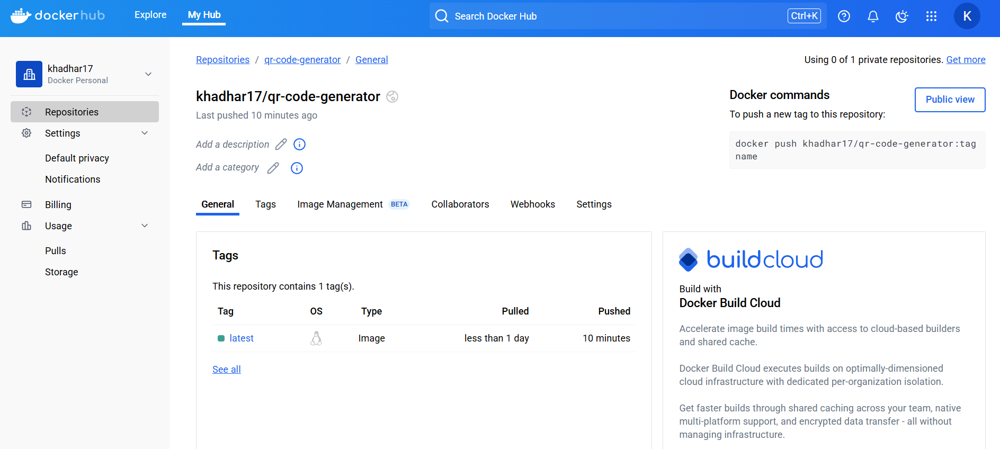

# Docker CI/CD Pipeline Assignment

This assignment implements a CI/CD workflow using GitHub Actions to automatically build and push a Docker image to Docker Hub.

## Overview

This repository contains a QR code generator that:
1. Creates a QR code for a GitHub profile URL
2. Is packaged as a Docker container
3. Uses GitHub Actions for CI/CD pipeline

## CI/CD Pipeline Implementation

The GitHub Actions workflow in this repository:
1. Automatically runs when code is pushed to the repository
2. Tests the Python code to ensure it works properly 
3. Builds a Docker image from the Dockerfile
4. Pushes the image to Docker Hub with appropriate tags

## Docker Hub Image



## Setup Process

1. Created a Docker Hub account and access token
2. Added repository secrets for Docker Hub credentials
3. Created a GitHub Actions workflow file (.github/workflows/docker-image.yml)
4. Configured the workflow to test, build, and push the image

## Workflow File Details

The workflow file includes two jobs:
- `test`: Verifies that the Python code and dependencies work
- `build-and-push`: Builds and pushes the Docker image to Docker Hub

## How to Use the Docker Image

Pull the image from Docker Hub:
```bash
docker pull YOUR_DOCKERHUB_USERNAME/qr-code-generator:latest
```

Run the container:
```bash
docker run -d --name qr-generator \
  -e QR_DATA_URL="https://github.com/YOUR_GITHUB_USERNAME" \
  -v "$(pwd)/qr_codes:/app/qr_codes" \
  YOUR_DOCKERHUB_USERNAME/qr-code-generator:latest
```

## Fullfilling Requirements

- [x] Set up GitHub Actions workflow
- [x] Configure automated testing
- [x] Build Docker image on successful tests
- [x] Push image to Docker Hub
- [x] Add screenshot of Docker Hub repository